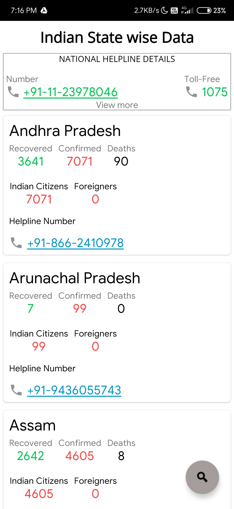

# CoronaTracker

A simple Android application which will help you track the latest spread of corona virus and other useful features.

Simple and light weight application.

ScreenShots :
-------------

     
    
 
 
 
  
  
  
  
 

<b>Backend Logic :</b> 

1. In-App Update : Firebase is implmented for In-App Update where whenever the user opens the app the current version of app is checked with the latest version given in firebase database, and if its lower than that of the latest version then user will get an update dialog with an intent to browser with latest download link.

2. Important Announcement Activity : the data is also fetched dynamically from firebase database. 

<b>Information Source :</b> 
----------------------------
<del>1. Global Tracker - https://github.com/ExpDev07/coronavirus-tracker-api<del>
 
1. Global Tracker - https://corona.lmao.ninja/countries

2. Precautions - https://www.who.int/emergencies/diseases/novel-coronavirus-2019/advice-for-public

3. COVID-19 Risk Level - New Jersey Department of Health 

4. Helpline Data - https://api.rootnet.in/covid19-in/contacts

<del>5. State Wise Data - https://api.rootnet.in/covid19-in/stats/latest<del>

5. State Wise Data - https://api.rootnet.in/covid19-in/unofficial/covid19india.org/statewise

<del>6. Indian Data - https://api.covid19india.org/data.json<del>

